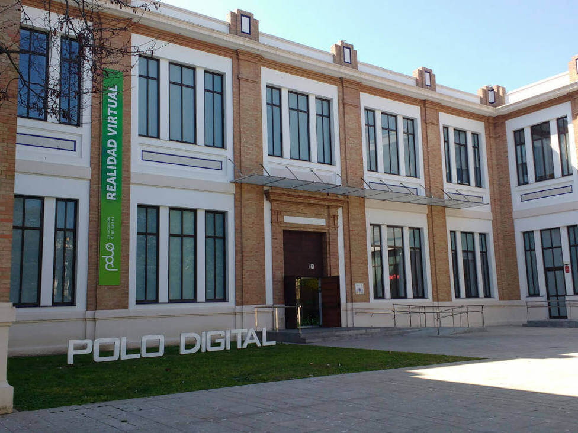

# Índice para DAM y DAW

Índice de referencia para alumnos de **DAM** (Desarrollo de Aplicaciones Multiplataforma) y **DAW** (Desarrollo de Aplicaciones Web) del **IES Campanillas** (Málaga).

## Índice general

* [Módulos profesionales](#módulos-profesionales)
* [Recogida de datos de alumnos](#recogida-de-datos-de-alumnos)
* [Calendario escolar](#calendario-escolar)
* [Normas de clase](#normas-de-clase)
* [Presentacion del IES Campanillas](#presentacion-del-ies-campanillas)
* [Perfiles de GitHub](#perfiles-de-github)
* [Horarios](#horarios)
* [Diario de trabajo de FP Dual](#diario-de-trabajo-de-fp-dual)
* [Proyecto final](#proyecto-final)
* [Localización](#localizacion)
* [Enlaces](#enlaces)

## Módulos profesionales

### 1º DAM
* [Bases de Datos](https://iescampanillas.com/aulavirtual/course/view.php?id=24)
* [Entornos de Desarrollo](https://iescampanillas.org/aulavirtual/course/view.php?id=15)
* [Lenguajes de Marcas](https://iescampanillas.org/aulavirtual/course/view.php?id=16)
* [Programación](https://github.com/LuisJoseSanchez/programacion)
* [Sistemas Informáticos](https://iescampanillas.org/aulavirtual/course/view.php?id=22)
* [Formación y Orientación Laboral](http://#)

### 1º DAW
* [Bases de Datos](https://iescampanillas.org/aulavirtual)
* [Entornos de Desarrollo](http://iescampanillas.com/moodle/course/view.php?id=10)
* [Lenguajes de Marcas](http://iescampanillas.com/moodle/course/view.php?id=7)
* [Programación](https://github.com/LuisJoseSanchez/programacion)
* [Sistemas Informáticos](https://iescampanillas.com/aulavirtual/course/view.php?id=22)
* [Formación y Orientación Laboral](http://#)

### 2º DAM
* [Acceso a datos](https://github.com/LuisJoseSanchez/ionic)
* [Programación de servicios y procesos](http://iescampanillas.com/moodle/course/view.php?id=69)
* [Programación multimedia y de dispositivos móviles](http://iescampanillas.com/moodle/course/view.php?id=68)
* [Horas de Libre Configuración (English)](http://iescampanillas.com/moodle/course/view.php?id=44)
* [Empresa e Iniciativa Emprendedora](http://#)
* [Sistemas de gestión de empresas](https://classroom.google.com/u/0/w/Mzg5MzMzNTQ5NjU0/t/all)

### 2º DAW
* [Desarrollo Web en Entorno Cliente](https://classroom.google.com/u/0/w/MzcxMzg4MDE0NzQ1/t/all)
* [Desarrollo Web en Entorno Servidor](http://iescampanillas.com/moodle/course/view.php?id=62)
* [Despliegue de Aplicaciones Web](http://iescampanillas.com/moodle/course/view.php?id=30)
* [Diseño de Interfaces WEB](http://iescampanillas.com/moodle/course/view.php?id=15)
* [Horas de Libre Configuración (English)](https://classroom.google.com/u/0/c/Mzg5NTE4NTEyMzgw)
* [Empresa e Iniciativa Emprendedora](http://#)

## Recogida de datos de alumnos

[Formulario de recogida de datos](https://docs.google.com/forms/d/e/1FAIpQLScuaE0yDEzbDe8kSUFBHRi9pndtiruPwckb_EE8pVvCzDY-hg/viewform) a rellenar por todos los alumnos que cursan el ciclo.

<!--

## Listas de correo

Para cada grupo del Ciclo Formativo existe una lista de correo (grupo de Google). Únicamente se admitirán los alumnos que aparezcan en la matrícula oficial y que, además, hayan rellenado el formulario del apartado anterior.

Para ser admitido en la lista, cada alumno debe entrar en el grupo que le corresponda (enlaces de abajo) y solicitar la admisión en el grupo. En el campo de texto que debe aparecer, hay que introducir nombre y apellidos y el curso.

[dam18-20@iescampanillas.com](https://groups.google.com/a/iescampanillas.com/forum/?utm_medium=email&utm_source=footer#!forum/dam18-20)

* [IES Campanillas DAW - Promoción 2018/2020](https://groups.google.com/d/forum/ies-campanillas-daw-2018-2020): `ies-campanillas-daw-2018-2020@googlegroups.com`
* [IES Campanillas DAM - Promoción 2018/2020](https://groups.google.com/d/forum/ies-campanillas-dam-2018-2020): `ies-campanillas-dam-2018-2020@googlegroups.com`
-->

## Teams

[Canal de Teams del IES Campanillas](https://teams.microsoft.com)

## Canal de Slack

[Canal de Slack del IES Campanillas](https://fpiescampanillas.slack.com)
(A extinguir)

## Calendario escolar

[Calendario del curso escolar 2021/2022 para Málaga](calendario_escolar_21_22.pdf)

## Normas de clase

[Normas de clase y funcionamiento de los Ciclos Formativos en el PTA](normas_y_funcionamientov2.pdf)

## Presentacion del IES Campanillas

En la siguiente presentación se muestra la oferta educativa del IES Campanillas, el currículo de los Ciclos Formativos de Grado Superior de **Desarrollo de Aplicaciones Multiplataforma** y **Desarrollo de Aplicaciones Web**, información sobre las **FCT** (prácticas en empresas) y sobre la **Formación Profesional Dual**.

[Presentacion del IES Campanillas](https://rawgit.com/LuisJoseSanchez/presentacion-ies-campanillas/master/index.html)

##  :octocat: Perfiles de GitHub

### Grupo IES Campanillas

[Perfil del grupo IES Campanillas](https://github.com/IESCampanillas)

### Profesores

[Luis José Sánchez](https://github.com/LuisJoseSanchez)

[Eva María Perales Belizón](https://github.com/evaperales) 

[José Juan García Mayorga](https://github.com/josejuanmayorga)

Javier 

[Juan Antonio Jiménez](https://github.com/profesorjim) 

[Antonio José Sánchez](https://github.com/bilbobolson) 

Pilar Gónzalez Augusto

Isabel Gregory Chicano

### Alumnos

#### DAW

[Perfiles de GitHub de alumnos de DAW de la promoción 2020 - 2022](https://github.com/IESCampanillas/github-alumnos-daw-20-22)

[Perfiles de GitHub de alumnos de DAW de la promoción 2019 - 2021](https://github.com/IESCampanillas/github-alumnos-daw-1921)

[Perfiles de GitHub de alumnos de DAW de la promoción 2017 - 2019](https://github.com/LuisJoseSanchez/github-alumnos-daw-1719)

#### DAM

[Perfiles de GitHub de alumnos de DAM de la promoción 2020 - 2022](https://github.com/IESCampanillas/github-alumnos-dam-20-22)

[Perfiles de GitHub de alumnos de DAM de la promoción 2019 - 2021](https://github.com/IESCampanillas/github-alumnos-dam-1921)

[Perfiles de GitHub de alumnos de DAM de la promoción 2018 - 2020](https://github.com/IESCampanillas/github-alumnos-dam-1820)

[Perfiles de GitHub de alumnos de DAM de la promoción 2017 - 2019](https://github.com/LuisJoseSanchez/github-alumnos-dam-1719)

## Horarios

### 1º DAM

| Lunes | Martes | Miércoles | Jueves | Viernes |
| :---: | :---:  |   :---:   | :---:  |  :---:  |
|  PRO  |  PRO   |   SINF    |  PRO   |  SINF   |
|  PRO  |  PRO   |   SINF    |  PRO   |  SINF   |
|  LM   |  PRO   |   SINF    |  PRO   |  SINF   |
|  ED   |  BBDD  |   LM      |  BBDD  |  FOL    |
|  ED   |  BBDD  |   LM      |  BBDD  |  FOL    |
|  ED   |  BBDD  |   LM      |  BBDD  |  FOL    |

ED: Entornos de Desarrollo. Pilar González.

PRO: Programación. Luis José Sánchez.

BBDD: Bases de Datos. Eva Mª Perales.

LM: Lenguajes de Marcas y Sistemas de Gestión de Información. Pilar González.

SINF: Sistemas Informáticos. Gregorio Coronado Morón.

FOL: Formación y Orientación Laboral. Rosa Carmen (DAM)

Delegado: (Pendiente de asignación)

Subdelegado: (Pendiente de asignación)

### 1º DAW

| Lunes | Martes | Miércoles | Jueves | Viernes |
| :---: | :---:  |   :---:   | :---:  |  :---:  |
|  LM   |  ED    |   ED      |  LM    |   FOL   |
|  LM   |  BBDD  |   ED      |  LM    |   FOL   |
|  PROG |  BBDD  |   PROG    |  PROG  |   FOL   |
|  PROG |  PROG  |   PROG    |  PROG  |   SINF  |
|  BBDD |  PROG  |   BBDD    |  SINF  |   SINF  |
|  BBDD |  SINF  |   BBDD    |  SINF  |   SINF  |

SINF: Sistemas Informáticos. Juan Carlos Amaya.

FOL: Formación y Orientación Laboral. Isabel Gregory.

PRO: Programación. Juan Antonio Jiménez.

BBDD: Bases de Datos. Eva Mª Perales.

LM: Lenguajes de Marcas y Sistemas de Gestión de Información. Pilar González.

ED: Entornos de Desarrollo. Pilar González.

### 2º DAM

| Lunes | Martes | Miércoles | Jueves | Viernes |
| :---: | :---:  |   :---:   | :---:  |  :---:  |
|  PSP  |  DI    |   AD      |  PSP   |  EIEM   |
|  PSP  |  DI    |   AD      |  PSP   |  EIEM   |
|  PSP  |  PSP   |   DI      |  DI    |  EIEM   |
|  SGE  |  PSP   |   DI      |  DI    |  HLC    |
|  SGE  |  AD    |   EIEM    |  DI    |  HLC    |
|  SGE  |  AD    |   SGE     |  AD    |  HLC    |

AD: Acceso a Datos. Luis José Sánchez.

EIEM: Empresa e Iniciativa Emprendedora. Isabel Gregory (DAW) y Paqui Báez Barrionuevo (DAM).

PMDM: Proyecto Multimedia y Dispositivos Móviles. Antonio J. Sánchez.

PSP: Programación de Servicios y Procesos. Antonio J. Sánchez.

DI: Diseño de Interface. Moisés Martínez.

SGE: Sistemas de Gestión Empresarial. José Juan García Mayorga.

HLC: Horas de Libre Configuración. Sergio Banderas.

### 2º DAW

| Lunes | Martes | Miércoles | Jueves | Viernes |
| :---: | :---:  |   :---:   | :---:  |  :---:  |
|  DAW  |  DWEC  |   DWES    |  DWEC  |  HLC    |
|  DAW  |  DWEC  |   DWES    |  DWEC  |  HLC    |
|  DAW  |  DWEC  |   DWES    |  DWEC  |  HLC    |
|  DWES |  DI    |   EIEM    |  DWES  |  EIEM   |
|  DWES |  DI    |   DI      |  DWES  |  EIEM   |
|  DWES |  DI    |   DI      |  DI    |  EIEM   |

EIEM: Empresa e Iniciativa Emprendedora. Paqui.

DWES: Desarrollo Web en Entorno Servidor. Antonio J. Sánchez.

DI: Diseño de Interface. Moisés Martínez.

DAW: Despliegue de Aplicaciones Web. Juan Antonio Jiménez.

DWEC: Desarrollo Web en Entorno Cliente. José Juan García Mayorga.

HLC: Horas de Libre Configuración. José Juan García Mayorga.

## Diario de trabajo de FP Dual

:notebook: <https://diariofp.online>

## Proyecto final

Las instrucciones para la realización del proyecto final de DAM están en el siguiente repositorio:

:octocat: <https://github.com/IESCampanillas/proyectos-dam-2019>

## Localización

[DAW: C/ Marie Curie, 10. 29590, PTA](https://goo.gl/maps/Hi65Z7uMpk467kyD9)

[DAM, SMR, Curso de especialización de Ciberseguridad: C/ Frederick Terman,3. 29590, PTA](https://goo.gl/maps/LU6FGYA9KgG2EF947)

[Curso de especialización de Videojuegos: Av de Sor Teresa Prat, 15, 29003 Málaga](https://goo.gl/maps/EqTUhpbXWf9n5Aaz9)

## Enlaces

[IES Campanillas (web oficial)](http://iescampanillas.com/)

[Plataforma educativa Moodle](https://iescampanillas.com/aulavirtual/)

:star: Si te ha gustado este repo, dale una estrellita :wink:
